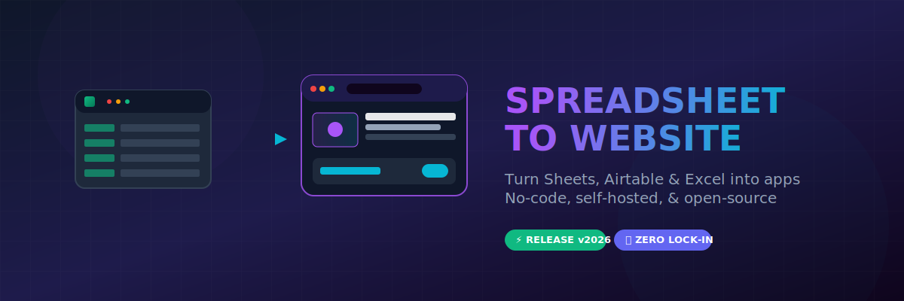

# 📊 Awesome Spreadsheet-To-Website

  

## 🚀 Top Spreadsheet to Website / App Builders (2026)

Transform your Google Sheets, Excel, or Airtable data into beautiful, functional websites, portals, dashboards, and full web/mobile apps — with **minimal or no coding**. 

This guide covers the best proprietary no-code tools (**Softr, Glide, Noloco, Stacker, AppSheet, Bubble, Adalo, SpreadSimple**) **and emphasizes open-source/self-hosted alternatives** for full data ownership, no vendor lock-in, and cost savings. Perfect for internal tools, client portals, directories, CRMs, and more.

## 🤔 Why Spreadsheet-to-Web Tools?

- ⚡ **Fast prototyping**: Turn existing data into apps in minutes/hours.
- 🔄 **Real-time sync**: Changes in your spreadsheet reflect instantly (in most tools).
- 🧩 **No/low code**: Drag-and-drop builders, templates, and AI assistance.
- 💼 **Use cases**: Internal dashboards, client portals, membership sites, directories, inventory tools, CRMs, and lightweight SaaS MVPs.

**Proprietary tools** are quick to start but often involve subscription costs and vendor lock-in. **Open-source options** give you self-hosting, customization, and freedom.

## 📊 Quick Comparison Table

| Tool              | Type          | Best For                          | Pricing (starting)      | Self-Hosted / Open-Source | Key Strength                  | Limitations                  |
|-------------------|---------------|-----------------------------------|-------------------------|---------------------------|-------------------------------|------------------------------|
| **Glide**        | Proprietary  | Mobile-friendly apps from Sheets | Free → $25+/mo         | No                       | Speed & polish from spreadsheets | Limited complex logic       |
| **Softr**        | Proprietary  | Portals & membership sites       | Free → $49+/mo         | No                       | Airtable/Sheets integration   | Record/user limits on lower tiers |
| **Noloco**       | Proprietary  | Client portals & operations      | Free → $149+/mo        | No                       | Permissions & workflows       | Higher cost for teams       |
| **Stacker**      | Proprietary  | AI-assisted portals              | Free → $50+/mo         | No                       | Business ops depth            | Pricing scales with usage   |
| **AppSheet**     | Proprietary (Google) | Google Workspace apps           | Free → $5+/user/mo     | Limited                  | Spreadsheet + mobile          | Google ecosystem focus      |
| **Bubble**       | Proprietary  | Complex full web apps            | Free → $29+/mo         | No                       | Custom logic & databases      | Steeper learning curve      |
| **Adalo**        | Proprietary  | Native mobile apps               | Free → $36+/mo         | No                       | Mobile publishing             | Less ideal for web portals  |
| **SpreadSimple** | Proprietary  | Simple sites from Sheets         | Varies                 | No                       | SEO & e-commerce features     | More niche                  |
| **Budibase**     | Open-Source  | Internal tools & CRUD apps       | Free (self-host)       | Yes (Docker/K8s)         | Flexible UI + automations     | Some setup required         |
| **Appsmith**     | Open-Source  | Dashboards & internal tools      | Free (self-host)       | Yes                      | Drag-drop + JS customization  | More dev-friendly           |
| **NocoDB**       | Open-Source  | Airtable-like databases + apps   | Free (self-host)       | Yes                      | Spreadsheet UI + forms        | Primarily data layer        |
| **ToolJet**      | Open-Source  | Low-code internal tools          | Free (self-host)       | Yes                      | 80+ connectors + AI           | UI builder focus            |
| **NocoBase**     | Open-Source  | Complex relational apps (CRM/ERP)| Free (self-host)       | Yes                      | Data modeling & permissions   | Steeper for simple use      |
| **Baserow**      | Open-Source  | No-code databases & apps         | Free (self-host)       | Yes                      | Airtable alternative          | Growing app builder         |
| **Mathesar**     | Open-Source  | Spreadsheet-style on Postgres    | Free (self-host)       | Yes                      | Intuitive for non-tech users  | Postgres-specific           |

*Open-source tools prioritized where they match or exceed proprietary capabilities for most users.*

## 💼 Proprietary Tools/SaaS

| Tool | Description & Best For | Starting Price | Free Tier Limit | Company Size (Valuation/Est.) |
|---|---|---|---|---|
| **AppSheet (Google)** | Native integration with Google Workspace. Great for field apps and mobile with offline support. | $5+/user/mo | Prototyping/test mode: up to 10 users, 5 databases, 1,000 rows per database | $2T+ (Parent Alphabet Inc.) / $400M+ Acq. |
| **Bubble** | Full-stack no-code for complex apps, marketplaces, and custom logic. | $29+/mo | Prototyping only: no custom domain, Bubble branding, limited Workload Units (WU), no live publishing | $1.7B - $2B |
| **Adalo** | Native mobile apps with drag-and-drop builder. | $36+/mo | Prototyping only: 200–500 database records, no publishing, Adalo branding | $180M - $200M |
| **Softr** | Build client portals, membership sites, and business tools on Airtable or Google Sheets. | $49+/mo | 1 published app, 10 logged-in users, 1,000 external records (5,000 Softr DB records) | $150M - $220M |
| **Glide** | Spreadsheet-first builder for polished mobile/web apps. Real-time sync with Google Sheets/Excel/Airtable. | $25+/mo | Prototyping only (no live publishing), 1 editor, 25,000 rows, 500MB storage, Glide tables only | $100M+ |
| **Stacker** | AI-assisted portals and business apps with deep data handling. | $50+/mo | Free trial only ($100 starter credits or 30-day trial); no permanent free-forever tier | $80M+ |
| **Noloco** | Client-facing portals with advanced permissions, workflows, and operations tools. | $149+/mo | 3 team members, 7 client seats, 2,000 records, 7 pages, Noloco Tables/Google Sheets/CSV only | $10M - $15M |
| **SpreadSimple** | Quick SEO-friendly sites with carts, filters, and checkout from Google Sheets. | $13+/mo | 3 free websites, 50 rows per sheet, 10 content pages, sandbox payments only, SpreadSimple branding | $3M - $5M |

## 🌐 Open-Source & Self-Hosted Alternatives (Primary Focus)

These are the stars for **data ownership, customization, zero ongoing SaaS fees** (beyond hosting), and extensibility. Deploy via Docker in minutes on your VPS, Kubernetes, or cloud.

### NocoDB 
- 🔌 Turns any database (Postgres, MySQL, etc.) into a smart spreadsheet with no-code UI.
- 🖼️ Forms, views (kanban, gallery), API generation — closest Airtable/Glide OSS feel.
- 📈 Extremely popular for spreadsheet-to-app workflows.

### Appsmith 
- 🎨 Drag-and-drop for admin panels, dashboards, and CRUD apps.
- 💻 JavaScript extensibility, 100+ integrations, Git version control.
- 🔄 Excellent Retool open-source alternative; self-host or cloud.

### ToolJet 
- 🤖 Visual low-code builder with broad connectors and AI assistance.
- 📊 Ideal for internal tools and data-heavy apps.

### Budibase 
- 🛠️ Low-code platform for internal tools, dashboards, forms, and workflows.
- 🔐 Connect to databases, APIs, Google Sheets; built-in auth & permissions.
- 🏠 Self-host easily; great UI builder.
- 👥 GitHub: Highly active community.

### NocoBase 
- 🗄️ Data model-driven no-code for complex apps (CRM, ERP-like).
- 🔑 Powerful permissions, plugins, and customization.

### Mathesar 
- 🗃️ Spreadsheet-style interface directly on PostgreSQL — perfect for non-technical users turning DBs into apps.

### Baserow 
- 📋 Open-source Airtable with app-building capabilities.

**Other notables**: Refine (React-based internal tools), Directus (headless + admin), Saltcorn (simple no-code web apps).

## 🛠️ Getting Started Recommendations

1. 🚀 **Quick start with spreadsheets** → Glide/Softr (proprietary) or **NocoDB/Baserow** (OSS).
2. 🏠 **Self-hosted priority** → **Budibase** or **Appsmith** for full apps; **NocoDB** for data-first.
3. 🧩 **Complex needs** → Bubble (proprietary) or combine NocoBase + frontend.
4. 📱 **Mobile focus** → Adalo or export from open tools + FlutterFlow-like.

💡 **Self-hosting tip**: Most run on a cheap VPS (~$5-20/mo) with Docker. Use tools like Coolify or Portainer for easier management.

## 📚 Resources & Next Steps

- 🔍 Explore GitHub repos for each OSS tool (stars indicate community health).
- 🧪 Test self-hosted demos (many have one-click Docker Compose).
- 🤖 Combine with automation (n8n, Activepieces) for full power.
- 📦 For code export/ownership: Some OSS + custom deployment paths.

🤝 Contributions welcome! Star this repo, add new tools, or suggest improvements.

💪 **Focus on open-source for freedom** — own your data and avoid recurring costs. Happy building! 🚀

*Last updated: July 2026. Inspired by community comparisons.*
Inspired by community comparisons.*
